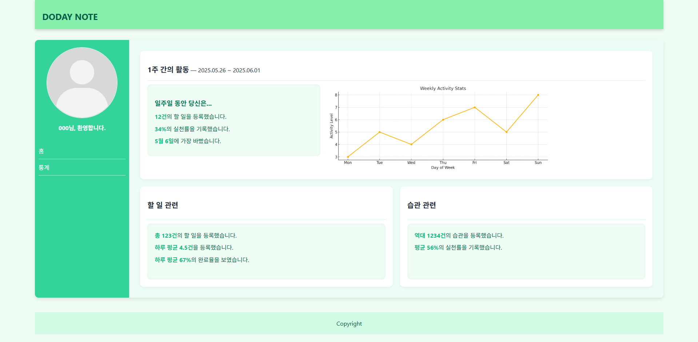

# DODAY NOTE

**DODAY NOTE**는 HTML/CSS로 제작한 일정/습관 관리 홈페이지 입니다.
오늘의 할 일과 매일의 습관을 포괄적으로 관리할 수 있으며, 그 외에도 향후 일정과 다이어리 기능을 제공합니다. 

## 

## 주요 기능
- 쉽고 빠른 할 일 등록
- 기간 단위로 간단하게 습관 등록
- 오늘의 할 일 뿐만 아닌 향후 일정도 등록
- 다이어리를 통한 메모 기능 지원
- 할 일에 중요도를 부여하여 중요한 일정을 더욱 세밀하게 관리 가능.
- 사용자의 할 일/습관 실천 관련 통계를 제공하여 성취감 향상.

## UI 이미지
### 홈 화면(home.html)

### 로그인 화면(login.html)

### 회원가입 화면(signup.html)

### 메인 화면(main.html)

### 통계 화면(ranking.html)

